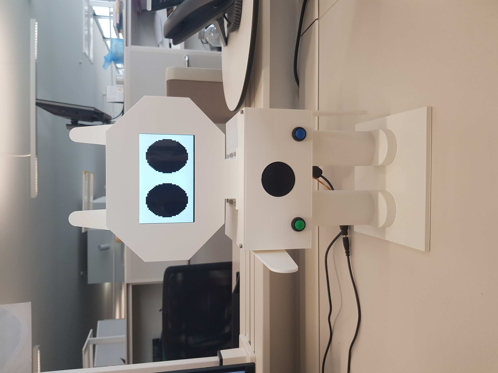

# PixelBot

This repository contains the work undertaken during my master's thesis at the Computer Human Interaction for Learning and Instruction (CHILI) laboratory, EPFL.

The main contribution of my thesis is PixelBot: a low-cost (≈300€), open-source, and DIY social robot, co-designed with and for children, and an associated robot-mediated storytelling activity aiming at raising children's awareness of existing gender inequality issues.

## What you will find inside this repository

- **[stl](https://github.com/RomainMaure/PixelBot/tree/main/stl)**: This folder contains all the parts to be 3D printed as well as a list of all the screws, nuts and other components required to build the robot.
- **[elec](https://github.com/RomainMaure/PixelBot/tree/main/elec)**: This folder contains all the informations related to the electronic of the robot, mainly, the circuit schematics and the list of the electronic components.
- **[src](https://github.com/RomainMaure/PixelBot/tree/main/src)**: This folder contains guidelines to setup the software of the robot as well as the main source code used to run the learning interaction between the robot and the children.
- **[pdf](https://github.com/RomainMaure/PixelBot/tree/main/pdf)**: This folder contains all additional material used in this research work. The participatory design toolkit is available both in French and English and both as a pdf or as a pptx. This folder also contains the data that has been collected during the two iterations of our final experiment, mainly the anonymized transcription of the discussion.
- **[imgs](https://github.com/RomainMaure/PixelBot/tree/main/imgs)**: This folder contains the images used in the different README of this repository.

## Publications

If you use this work in an academic context, please cite the [following publication](https://ieeexplore.ieee.org/document/10309391):

* Maure, Romain, and Barbara Bruno. **"Participatory design of a social robot and robot-mediated storytelling activity to raise awareness of gender inequality among children."** 2023 32nd IEEE International Conference on Robot and Human Interactive Communication (RO-MAN). IEEE, 2023.

        @inproceedings{maure2023participatory,
          title={Participatory design of a social robot and robot-mediated storytelling activity to raise awareness of gender inequality among children},
          author={Maure, Romain and Bruno, Barbara},
          booktitle={2023 32nd IEEE International Conference on Robot and Human Interactive Communication (RO-MAN)},
          pages={974--981},
          year={2023},
          organization={IEEE}}

## License

The whole repository is under [GPL-3.0](https://github.com/RomainMaure/PixelBot/blob/main/LICENSE) license.
