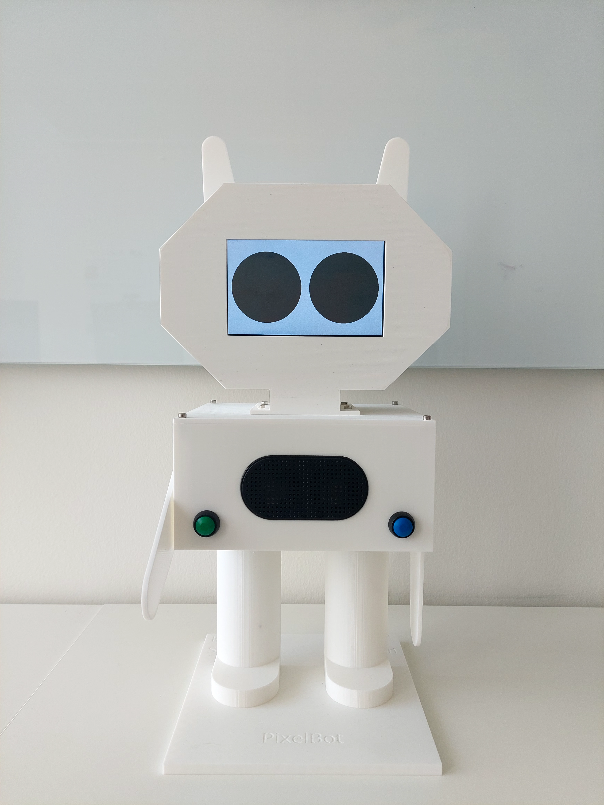

# PixelBot V2

This repository contains the work undertaken during my master's thesis at the [Computer Human Interaction for Learning and Instruction (CHILI) laboratory, EPFL, Switzerland](https://www.epfl.ch/labs/chili/), and later improved during my PhD at the [Socially Assistive Robotics with Artificial Intelligence (SARAI) laboratory, KIT, Germany](https://sarai.iar.kit.edu/).

The main contribution of this repository is PixelBot: a low-cost (<300€), open-source, and DIY social robot, co-designed with and for children.

**This branch contains an updated version of PixelBot:**
- Hardware modification:
  - Raspberry Pi 5 instead of Raspberry Pi 4.
  - USB stereo speaker instead of audio-jack mono speaker.
  - Some of the issues of PixelBot V1 are fixed.
  - Easier to build compared to PixelBot V1. 
- Software modification:
  - Ubuntu 24 instead of Ubuntu 22.
  - ROS2 Jazzy instead of ROS2 Humble. 
  - Some of the ROS2 packages are updated.
- Guidelines for the robot assembly.

## What you will find inside this repository

- **[assembly](https://github.com/RomainMaure/PixelBot/tree/pixelbot_v2/assembly)**: This folder contains the list of components required to build the robot, all the parts to be 3D printed, the circuit schematics, and guidelines to assemble the robot.
- **[src](https://github.com/RomainMaure/PixelBot/tree/pixelbot_v2/src)**: This folder contains guidelines to setup the software of the robot as well as the main source code for the robot's ROS2 nodes.
- **[pdf](https://github.com/RomainMaure/PixelBot/tree/pixelbot_v2/pdf)**: This folder contains all additional material used in this research work. The participatory design toolkit is available both in French and English and both as a pdf or as a pptx. This folder also contains the data that has been collected during the two iterations of our final experiment, mainly the anonymized transcription of the discussion.
- **[imgs](https://github.com/RomainMaure/PixelBot/tree/pixelbot_v2/imgs)**: This folder contains the images used in the different README of this repository.

## Publications

If you use this work in an academic context, please cite the [following publication](https://ieeexplore.ieee.org/document/10309391):

* Maure, Romain, and Barbara Bruno. **"Participatory design of a social robot and robot-mediated storytelling activity to raise awareness of gender inequality among children."** 2023 32nd IEEE International Conference on Robot and Human Interactive Communication (RO-MAN). IEEE, 2023.

        @inproceedings{maure2023participatory,
          title={Participatory design of a social robot and robot-mediated storytelling activity to raise awareness of gender inequality among children},
          author={Maure, Romain and Bruno, Barbara},
          booktitle={2023 32nd IEEE International Conference on Robot and Human Interactive Communication (RO-MAN)},
          pages={974--981},
          year={2023},
          organization={IEEE}}

## License

The whole repository is under [GPL-3.0](https://github.com/RomainMaure/PixelBot/blob/main/LICENSE) license.
