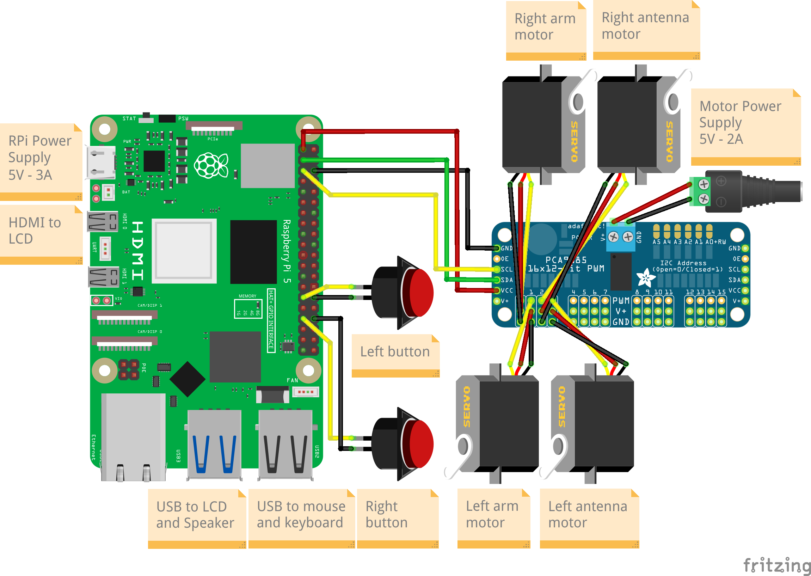

# Assembly

## Bill of materials

The table below describes all the components to be bought to build the robot. In addition to these items, we also assume that you have a [3D-printer](https://www.prusa3d.com/product/original-prusa-mk4s-3d-printer-5/), a [soldering iron](https://www.welectron.com/Miniware-Soldering-Iron-TS100), and a [screwdriver kit](https://www.ifixit.com/en-eu/products/mako-driver-kit-64-precision-bits).

<table>
    <thead>
        <tr>
            <th style='text-align:center; vertical-align:middle'>Component</th>
            <th style='text-align:center; vertical-align:middle'>Quantity</th>
            <th style='text-align:center; vertical-align:middle'>Price (EUR)</th>
        </tr>
    </thead>
    <tbody>
        <tr>
            <td style='text-align:center; vertical-align:middle'> <a href="https://www.berrybase.de/en/detail/018ea8d227c773658291fb9496fa612f">Raspberry Pi 5 (8GB)</a> </td>
            <td style='text-align:center; vertical-align:middle'>1</td>
            <td style='text-align:center; vertical-align:middle'>83,50</td>
        </tr>
        <tr>
            <td style='text-align:center; vertical-align:middle'> <a href="https://www.berrybase.de/en/detail/019234a5bfb57193899acec14a1eebd6">Raspberry Pi 5 power supply (27W)</a> </td>
            <td style='text-align:center; vertical-align:middle'>1</td>
            <td style='text-align:center; vertical-align:middle'>12,40</td>
        </tr>
        <tr>
            <td style='text-align:center; vertical-align:middle'> <a href="https://www.berrybase.de/en/raspberry-pi-active-cooler-fan-for-raspberry-pi-5">Raspberry Pi 5 Active Cooler</a> </td>
            <td style='text-align:center; vertical-align:middle'>1</td>
            <td style='text-align:center; vertical-align:middle'>5,80</td>
        </tr>
        <tr>
            <td style='text-align:center; vertical-align:middle'> <a href="https://www.conrad.de/de/p/intenso-64gb-microsdxc-performance-microsd-karte-64-gb-class-10-uhs-i-wasserdicht-2859941.html">Micro SD card (64GB)</a> </td>
            <td style='text-align:center; vertical-align:middle'>1</td>
            <td style='text-align:center; vertical-align:middle'>5,99</td>
        </tr>
        <tr>
            <td style='text-align:center; vertical-align:middle'> <a href="https://www.conrad.de/de/p/hama-00124022-usb-3-0-multi-kartenleser-sd-microsd-cf-schwarz-1416360.html">Micro SD card adaptor (optional, if you don't have an SD card reader)</a> </td>
            <td style='text-align:center; vertical-align:middle'>1</td>
            <td style='text-align:center; vertical-align:middle'>12,99</td>
        </tr>
        <tr>
            <td style='text-align:center; vertical-align:middle'> <a href="https://www.berrybase.de/externer-usb-mini-lautsprecher-schwarz">Speaker</a> </td>
            <td style='text-align:center; vertical-align:middle'>1</td>
            <td style='text-align:center; vertical-align:middle'>6,80</td>
        </tr>
        <tr>
            <td style='text-align:center; vertical-align:middle'> <a href="https://www.waveshare.com/product/displays/5inch-hdmi-lcd-h-v4.htm">5" HDMI LCD</a> </td>
            <td style='text-align:center; vertical-align:middle'>1</td>
            <td style='text-align:center; vertical-align:middle'>43,99</td>
        </tr>
        <tr>
            <td style='text-align:center; vertical-align:middle'> <a href="https://www.amazon.de/-/en/RIIEYOCA-Degree-Right-48Gbps-Supports/dp/B0CNBZYKHJ?crid=1L04SVAZH7BQP&dib=eyJ2IjoiMSJ9.rT1rzN_bPqQnemecZ43PQmk0Kw4tawvmwqymVECIpzf6cfftYvvj0vpQxMRVw2G8bS7-mM_fj4QI88yFiuQVEgNAcqmA-PUmE0YJAAY4_G1tiOdt5um-jqlyNID4ohe1XMix7H7YkiSCTDVEc3wJ4bKehEsM6zl30nBCGIe6oZ89ibZ7zKCONGJi9KGAZpFoiKUuYqXdFdDJuMXg65lCQKeNn69KZ6gQONXCBgGiICzspMB1ItgUBsfq63j9On_L3c5GbTx9KShroldLGNMzULf68syT6O0On3LBE4kMxiw.27CHApUCApwcDw5kkyNJSvG7VmWonKvAg_k-TzuMIkQ&dib_tag=se&keywords=riieyoca%2B90%2Bgrad&qid=1755075493&sprefix=RIIEYOCA%2B90%2Caps%2C161&sr=8-17&th=1">HDMI to micro HDMI cable (50cm, 90° right)</a> </td>
            <td style='text-align:center; vertical-align:middle'>1</td>
            <td style='text-align:center; vertical-align:middle'>11,99</td>
        </tr>
        <tr>
            <td style='text-align:center; vertical-align:middle'> <a href="https://www.reichelt.com/de/en/shop/product/universal_power_supply_unit_with_usb_port_3_-_12_v_24_w-348764">Motor power supply (5V - 2A)</a> </td>
            <td style='text-align:center; vertical-align:middle'>1</td>
            <td style='text-align:center; vertical-align:middle'>11,60</td>
        </tr>
        <tr>
            <td style='text-align:center; vertical-align:middle'> <a href="https://www.roboter-bausatz.de/p/16-kanal-pwm-servomotortreiber-fuer-arduino-raspberry-pi">PCA9685</a> </td>
            <td style='text-align:center; vertical-align:middle'>1</td>
            <td style='text-align:center; vertical-align:middle'>5,29</td>
        </tr>
        <tr>
            <td style='text-align:center; vertical-align:middle'> <a href="https://www.roboter-bausatz.de/p/sg90-9g-micro-servomotor">SG90 servo motor</a> </td>
            <td style='text-align:center; vertical-align:middle'>4</td>
            <td style='text-align:center; vertical-align:middle'>7,40</td>
        </tr>
        <tr>
            <td style='text-align:center; vertical-align:middle'> <a href="https://www.roboter-bausatz.de/p/drucktaster-button-schalter-gruen-12mm-250v-1a">Push pull button (green)</a> </td>
            <td style='text-align:center; vertical-align:middle'>1</td>
            <td style='text-align:center; vertical-align:middle'>0,85</td>
        </tr>
        <tr>
            <td style='text-align:center; vertical-align:middle'> <a href="https://www.roboter-bausatz.de/p/drucktaster-button-schalter-blau-12mm-250v-1a">Push pull button (blue)</a> </td>
            <td style='text-align:center; vertical-align:middle'>1</td>
            <td style='text-align:center; vertical-align:middle'>0,75</td>
        </tr>
        <tr>
            <td style='text-align:center; vertical-align:middle'> <a href="https://www.berrybase.de/en/40pin-jumper-dupont-cable-set-1x-f-f-m-m-f-m-each-20cm">Male to Male wire</a> </td>
            <td style='text-align:center; vertical-align:middle'>2</td>
            <td style='text-align:center; vertical-align:middle' rowspan="3">4,90</td>
        </tr>
        <tr>
            <td style='text-align:center; vertical-align:middle'> <a href="https://www.berrybase.de/en/40pin-jumper-dupont-cable-set-1x-f-f-m-m-f-m-each-20cm">Female to Female wire</a> </td>
            <td style='text-align:center; vertical-align:middle'>4</td>
        </tr>
        <tr>
            <td style='text-align:center; vertical-align:middle'> <a href="https://www.berrybase.de/en/40pin-jumper-dupont-cable-set-1x-f-f-m-m-f-m-each-20cm">Male to Female wire</a> </td>
            <td style='text-align:center; vertical-align:middle'>4</td>
        </tr>
        <tr>
            <td style='text-align:center; vertical-align:middle'> <a href="https://www.amazon.de/-/en/Cylinder-Stainless-Machine-Threaded-Assortment/dp/B0DSW64NMS?crid=R4SQRZGOXE99&dib=eyJ2IjoiMSJ9.dkoBUSWCIPuLf2zjB1Dnm_zWW4UdlyrzENjC9DNf9u4YbFvNW-vJAz5aHoz-F39ysZmBTrbb-wtnYI7FxOYCLweqb3Pfg8cnLN34SaBXNzYb3vOap85ui8BFe-80eoz9JVuCwlMwi0UooFLHNyNpZOkyLIc-oQ1gEM-MvdkvMuTJ9hjvy23qZceUYjS65c3KLggyHTE_B_nHPtImRk-WrOjmb_iYLrWcpjQlXSfx_W1pzRLmqXJcq_XtvxicA63mtl2DsMibqaXBjTJHXIoWepBF3DadRzfCKHtkXJa7nb4.P5tkunCQVxdvJ1pbNYuESiaG140zi5qWgs-N6ro_MMc&dib_tag=se&keywords=screw%2Bkit%2BM2%2BM3&qid=1754575492&sprefix=screw%2Bkit%2Bm2%2Bm3%2Caps%2C136&sr=8-10&th=1">M2x8 screw</a> </td>
            <td style='text-align:center; vertical-align:middle'>12</td>
            <td style='text-align:center; vertical-align:middle' rowspan="7">10,99</td>
        </tr>
        <tr>
            <td style='text-align:center; vertical-align:middle'> <a href="https://www.amazon.de/-/en/Cylinder-Stainless-Machine-Threaded-Assortment/dp/B0DSW64NMS?crid=R4SQRZGOXE99&dib=eyJ2IjoiMSJ9.dkoBUSWCIPuLf2zjB1Dnm_zWW4UdlyrzENjC9DNf9u4YbFvNW-vJAz5aHoz-F39ysZmBTrbb-wtnYI7FxOYCLweqb3Pfg8cnLN34SaBXNzYb3vOap85ui8BFe-80eoz9JVuCwlMwi0UooFLHNyNpZOkyLIc-oQ1gEM-MvdkvMuTJ9hjvy23qZceUYjS65c3KLggyHTE_B_nHPtImRk-WrOjmb_iYLrWcpjQlXSfx_W1pzRLmqXJcq_XtvxicA63mtl2DsMibqaXBjTJHXIoWepBF3DadRzfCKHtkXJa7nb4.P5tkunCQVxdvJ1pbNYuESiaG140zi5qWgs-N6ro_MMc&dib_tag=se&keywords=screw%2Bkit%2BM2%2BM3&qid=1754575492&sprefix=screw%2Bkit%2Bm2%2Bm3%2Caps%2C136&sr=8-10&th=1">M2x16 screw</a> </td>
            <td style='text-align:center; vertical-align:middle'>8</td>
        </tr>
        <tr>
            <td style='text-align:center; vertical-align:middle'> <a href="https://www.amazon.de/-/en/Cylinder-Stainless-Machine-Threaded-Assortment/dp/B0DSW64NMS?crid=R4SQRZGOXE99&dib=eyJ2IjoiMSJ9.dkoBUSWCIPuLf2zjB1Dnm_zWW4UdlyrzENjC9DNf9u4YbFvNW-vJAz5aHoz-F39ysZmBTrbb-wtnYI7FxOYCLweqb3Pfg8cnLN34SaBXNzYb3vOap85ui8BFe-80eoz9JVuCwlMwi0UooFLHNyNpZOkyLIc-oQ1gEM-MvdkvMuTJ9hjvy23qZceUYjS65c3KLggyHTE_B_nHPtImRk-WrOjmb_iYLrWcpjQlXSfx_W1pzRLmqXJcq_XtvxicA63mtl2DsMibqaXBjTJHXIoWepBF3DadRzfCKHtkXJa7nb4.P5tkunCQVxdvJ1pbNYuESiaG140zi5qWgs-N6ro_MMc&dib_tag=se&keywords=screw%2Bkit%2BM2%2BM3&qid=1754575492&sprefix=screw%2Bkit%2Bm2%2Bm3%2Caps%2C136&sr=8-10&th=1">M3x8 screw	</a> </td>
            <td style='text-align:center; vertical-align:middle'>13</td>
        </tr>
        <tr>
            <td style='text-align:center; vertical-align:middle'> <a href="https://www.amazon.de/-/en/Cylinder-Stainless-Machine-Threaded-Assortment/dp/B0DSW64NMS?crid=R4SQRZGOXE99&dib=eyJ2IjoiMSJ9.dkoBUSWCIPuLf2zjB1Dnm_zWW4UdlyrzENjC9DNf9u4YbFvNW-vJAz5aHoz-F39ysZmBTrbb-wtnYI7FxOYCLweqb3Pfg8cnLN34SaBXNzYb3vOap85ui8BFe-80eoz9JVuCwlMwi0UooFLHNyNpZOkyLIc-oQ1gEM-MvdkvMuTJ9hjvy23qZceUYjS65c3KLggyHTE_B_nHPtImRk-WrOjmb_iYLrWcpjQlXSfx_W1pzRLmqXJcq_XtvxicA63mtl2DsMibqaXBjTJHXIoWepBF3DadRzfCKHtkXJa7nb4.P5tkunCQVxdvJ1pbNYuESiaG140zi5qWgs-N6ro_MMc&dib_tag=se&keywords=screw%2Bkit%2BM2%2BM3&qid=1754575492&sprefix=screw%2Bkit%2Bm2%2Bm3%2Caps%2C136&sr=8-10&th=1">M3x12 screw	</a> </td>
            <td style='text-align:center; vertical-align:middle'>6</td>
        </tr>
        <tr>
            <td style='text-align:center; vertical-align:middle'> <a href="https://www.amazon.de/-/en/Cylinder-Stainless-Machine-Threaded-Assortment/dp/B0DSW64NMS?crid=R4SQRZGOXE99&dib=eyJ2IjoiMSJ9.dkoBUSWCIPuLf2zjB1Dnm_zWW4UdlyrzENjC9DNf9u4YbFvNW-vJAz5aHoz-F39ysZmBTrbb-wtnYI7FxOYCLweqb3Pfg8cnLN34SaBXNzYb3vOap85ui8BFe-80eoz9JVuCwlMwi0UooFLHNyNpZOkyLIc-oQ1gEM-MvdkvMuTJ9hjvy23qZceUYjS65c3KLggyHTE_B_nHPtImRk-WrOjmb_iYLrWcpjQlXSfx_W1pzRLmqXJcq_XtvxicA63mtl2DsMibqaXBjTJHXIoWepBF3DadRzfCKHtkXJa7nb4.P5tkunCQVxdvJ1pbNYuESiaG140zi5qWgs-N6ro_MMc&dib_tag=se&keywords=screw%2Bkit%2BM2%2BM3&qid=1754575492&sprefix=screw%2Bkit%2Bm2%2Bm3%2Caps%2C136&sr=8-10&th=1">M3x20 screw	</a> </td>
            <td style='text-align:center; vertical-align:middle'>6</td>
        </tr>
        <tr>
            <td style='text-align:center; vertical-align:middle'> <a href="https://www.amazon.de/-/en/Cylinder-Stainless-Machine-Threaded-Assortment/dp/B0DSW64NMS?crid=R4SQRZGOXE99&dib=eyJ2IjoiMSJ9.dkoBUSWCIPuLf2zjB1Dnm_zWW4UdlyrzENjC9DNf9u4YbFvNW-vJAz5aHoz-F39ysZmBTrbb-wtnYI7FxOYCLweqb3Pfg8cnLN34SaBXNzYb3vOap85ui8BFe-80eoz9JVuCwlMwi0UooFLHNyNpZOkyLIc-oQ1gEM-MvdkvMuTJ9hjvy23qZceUYjS65c3KLggyHTE_B_nHPtImRk-WrOjmb_iYLrWcpjQlXSfx_W1pzRLmqXJcq_XtvxicA63mtl2DsMibqaXBjTJHXIoWepBF3DadRzfCKHtkXJa7nb4.P5tkunCQVxdvJ1pbNYuESiaG140zi5qWgs-N6ro_MMc&dib_tag=se&keywords=screw%2Bkit%2BM2%2BM3&qid=1754575492&sprefix=screw%2Bkit%2Bm2%2Bm3%2Caps%2C136&sr=8-10&th=1">M2 nut</a> </td>
            <td style='text-align:center; vertical-align:middle'>8</td>
        </tr>
        <tr>
            <td style='text-align:center; vertical-align:middle'> <a href="https://www.amazon.de/-/en/Cylinder-Stainless-Machine-Threaded-Assortment/dp/B0DSW64NMS?crid=R4SQRZGOXE99&dib=eyJ2IjoiMSJ9.dkoBUSWCIPuLf2zjB1Dnm_zWW4UdlyrzENjC9DNf9u4YbFvNW-vJAz5aHoz-F39ysZmBTrbb-wtnYI7FxOYCLweqb3Pfg8cnLN34SaBXNzYb3vOap85ui8BFe-80eoz9JVuCwlMwi0UooFLHNyNpZOkyLIc-oQ1gEM-MvdkvMuTJ9hjvy23qZceUYjS65c3KLggyHTE_B_nHPtImRk-WrOjmb_iYLrWcpjQlXSfx_W1pzRLmqXJcq_XtvxicA63mtl2DsMibqaXBjTJHXIoWepBF3DadRzfCKHtkXJa7nb4.P5tkunCQVxdvJ1pbNYuESiaG140zi5qWgs-N6ro_MMc&dib_tag=se&keywords=screw%2Bkit%2BM2%2BM3&qid=1754575492&sprefix=screw%2Bkit%2Bm2%2Bm3%2Caps%2C136&sr=8-10&th=1">M3 nut</a> </td>
            <td style='text-align:center; vertical-align:middle'>17</td>
        </tr>
        <tr>
            <td style='text-align:center; vertical-align:middle'> <a href="https://www.ruthex.de/en/collections/gewindeeinsatze/products/ruthex-gewindeeinsatz-m2-70-stuck-rx-m2x4-messing-gewindebuchsen">M2 insert</a> </td>
            <td style='text-align:center; vertical-align:middle'>8</td>
            <td style='text-align:center; vertical-align:middle'>8,99</td>
        </tr>
        <tr>
            <td style='text-align:center; vertical-align:middle'> <a href="https://www.ruthex.de/en/collections/gewindeeinsatze/products/ruthex-gewindeeinsatz-m3-100-stuck-rx-m3x5-7-messing-gewindebuchsen">M3 insert</a> </td>
            <td style='text-align:center; vertical-align:middle'>8</td>
            <td style='text-align:center; vertical-align:middle'>8,99</td>
        </tr>
        <tr>
            <td style='text-align:center; vertical-align:middle'> <a href="https://www.ifixit.com/en-eu/products/lead-free-solder">Solder</a> </td>
            <td style='text-align:center; vertical-align:middle'>1</td>
            <td style='text-align:center; vertical-align:middle'>4,95</td>
        </tr>
        <tr>
            <td style='text-align:center; vertical-align:middle'> <a href="https://www.conrad.de/de/p/renkforce-rf-4511190-filament-pla-1-75-mm-1000-g-weiss-1-st-2255595.html">1Kg spool of 1.75mm PLA filament</a> </td>
            <td style='text-align:center; vertical-align:middle'>1</td>
            <td style='text-align:center; vertical-align:middle'>29,99</td>
        </tr>
        <tr>
            <td style='text-align:center; vertical-align:middle'> <b>Total</b> </td>
            <td style='text-align:center; vertical-align:middle'>  </td>
            <td style='text-align:center; vertical-align:middle'> <b>278,16</b></td>
        </tr>
    </tbody>
</table>

## 3D prints

The table below describes the parts to be 3D printed to build the robot. All parts can be printed using PLA. A single [1Kg spool of 1.75mm PLA filament](https://www.conrad.de/de/p/renkforce-rf-4511190-filament-pla-1-75-mm-1000-g-weiss-1-st-2255595.html) is enough to print all the parts necessary to build the robot. The 3D printing surface should be of at least 180 x 180 mm. The [gcode folder](https://github.com/RomainMaure/PixelBot/tree/pixelbot_v2/3d_parts/gcode) contains printing configurations for all the parts and for a PRUSA MK4. If you have a different 3D-printer, you can generate gcodes specific to your printer using the [stl folder](https://github.com/RomainMaure/PixelBot/tree/pixelbot_v2/3d_parts/stl). The [step folder](https://github.com/RomainMaure/PixelBot/tree/pixelbot_v2/3d_parts/step) contains all the parts in step format, in case you would like to modify some of PixelBot's parts according to your specific use case.

| Component       |    Quantity     |
| :-------------: | :-------------: |
| [Bottom plate](https://github.com/RomainMaure/PixelBot/blob/pixelbot_v2/3d_parts/stl/bottom_plate.stl) |        1        |
| [Leg](https://github.com/RomainMaure/PixelBot/blob/pixelbot_v2/3d_parts/stl/leg.stl) |        2        |
| [Enclosure](https://github.com/RomainMaure/PixelBot/blob/pixelbot_v2/3d_parts/stl/enclosure.stl) |        1        |
| [Servo holder](https://github.com/RomainMaure/PixelBot/blob/pixelbot_v2/3d_parts/stl/servo_holder.stl) |        4        |
| [Arm](https://github.com/RomainMaure/PixelBot/blob/pixelbot_v2/3d_parts/stl/arm.stl)    |        2        |
| [Enclosure top](https://github.com/RomainMaure/PixelBot/blob/pixelbot_v2/3d_parts/stl/enclosure_top.stl)    |        1        |
| [Front head](https://github.com/RomainMaure/PixelBot/blob/pixelbot_v2/3d_parts/stl/front_head.stl)    |        1        |
| [Back head](https://github.com/RomainMaure/PixelBot/blob/pixelbot_v2/3d_parts/stl/back_head.stl)    |        1        |
| [Antenna](https://github.com/RomainMaure/PixelBot/blob/pixelbot_v2/3d_parts/stl/antenna.stl)    |        2        |

## Assembly

**The full assembly file is accessible on Onshape using the following [link](https://cad.onshape.com/documents/0097e1f04b722767a8e25ee0/w/35b2e9c861b5b79ef63a54c7/e/1c438358a0c7ac472798fb65?renderMode=0&uiState=68cae9d92fc7ca1f5e5d7300). You can make use of this link to help you with the assembly, or to create a copy of PixelBot and modify it according to your own needs.**

The table below describes the order in which the robot is assembled and how each part is connected to the others:

| Parts connexion       |    Needed to connect the parts    |
| :-------------: | :-------------: |
| [Legs](https://github.com/RomainMaure/PixelBot/blob/pixelbot_v2/3d_parts/stl/leg.stl) to [Enclosure](https://github.com/RomainMaure/PixelBot/blob/pixelbot_v2/3d_parts/stl/enclosure.stl) |        6 M3x12 screws and 6 M3 nuts        |
|  [Bottom plate](https://github.com/RomainMaure/PixelBot/blob/pixelbot_v2/3d_parts/stl/bottom_plate.stl) to [Legs](https://github.com/RomainMaure/PixelBot/blob/pixelbot_v2/3d_parts/stl/leg.stl)  |        6 M3x20 screws and 6 M3 nuts        |
| [Raspberry Pi 5](https://github.com/RomainMaure/PixelBot/blob/pixelbot_v2/3d_parts/stl/other/RASPBERRY_PI_5_cooler.stl) to [Enclosure](https://github.com/RomainMaure/PixelBot/blob/pixelbot_v2/3d_parts/stl/enclosure.stl)    |        4 M2x8 screws and 4 M2 inserts         |
| [PCA9685](https://github.com/RomainMaure/PixelBot/blob/pixelbot_v2/3d_parts/stl/other/PCA9685.stl) to [Enclosure](https://github.com/RomainMaure/PixelBot/blob/pixelbot_v2/3d_parts/stl/enclosure.stl)    |        4 M2x8 screws and 4 M2 inserts         |
| [Servos](https://github.com/RomainMaure/PixelBot/blob/pixelbot_v2/3d_parts/stl/other/TowerPro_SG90.stl) to [Servo holders](https://github.com/RomainMaure/PixelBot/blob/pixelbot_v2/3d_parts/stl/servo_holder.stl) and [Enclosure](https://github.com/RomainMaure/PixelBot/blob/pixelbot_v2/3d_parts/stl/enclosure.stl)    |        4 M2x16 screws and 4 M2 nuts        |
| [Servos](https://github.com/RomainMaure/PixelBot/blob/pixelbot_v2/3d_parts/stl/other/TowerPro_SG90.stl) to [Servo holders](https://github.com/RomainMaure/PixelBot/blob/pixelbot_v2/3d_parts/stl/servo_holder.stl) and [Back head](https://github.com/RomainMaure/PixelBot/blob/pixelbot_v2/3d_parts/stl/back_head.stl)    |        4 M2x16 screws and 4 M2 nuts        |
| [LCD](https://github.com/RomainMaure/PixelBot/blob/pixelbot_v2/3d_parts/stl/other/WaveShare_5_LCD.stl) to [Front head](https://github.com/RomainMaure/PixelBot/blob/pixelbot_v2/3d_parts/stl/front_head.stl)   |     4 M3x8 screws and 4 M3 inserts          |
| [Front head](https://github.com/RomainMaure/PixelBot/blob/pixelbot_v2/3d_parts/stl/front_head.stl) to [Enclosure top](https://github.com/RomainMaure/PixelBot/blob/pixelbot_v2/3d_parts/stl/enclosure_top.stl)    |       2 M3x8 screws and 2 M3 nuts         |
| [Back head](https://github.com/RomainMaure/PixelBot/blob/pixelbot_v2/3d_parts/stl/back_head.stl) to [Enclosure top](https://github.com/RomainMaure/PixelBot/blob/pixelbot_v2/3d_parts/stl/enclosure_top.stl)    |    2 M3x8 screws and 2 M3 nuts            |
| [Front head](https://github.com/RomainMaure/PixelBot/blob/pixelbot_v2/3d_parts/stl/front_head.stl) to [Back head](https://github.com/RomainMaure/PixelBot/blob/pixelbot_v2/3d_parts/stl/back_head.stl)    |        1 M3x8 screw and 1 M3 nuts        |
| [Enclosure top](https://github.com/RomainMaure/PixelBot/blob/pixelbot_v2/3d_parts/stl/enclosure_top.stl) to [Enclosure](https://github.com/RomainMaure/PixelBot/blob/pixelbot_v2/3d_parts/stl/enclosure.stl)    |        4 M3X8 screws and 4 M3 inserts        |
| [Arms](https://github.com/RomainMaure/PixelBot/blob/pixelbot_v2/3d_parts/stl/arm.stl) to [Servos](https://github.com/RomainMaure/PixelBot/blob/pixelbot_v2/3d_parts/stl/other/TowerPro_SG90.stl)    |        2 M2X8 screws        |
| [Antennae](https://github.com/RomainMaure/PixelBot/blob/pixelbot_v2/3d_parts/stl/antenna.stl) to [Servos](https://github.com/RomainMaure/PixelBot/blob/pixelbot_v2/3d_parts/stl/other/TowerPro_SG90.stl)    |        2 M2X8 screws        |

The image bellow describes the wiring of the electronic components:

TODO: Video to describe the assembly of the robot.
