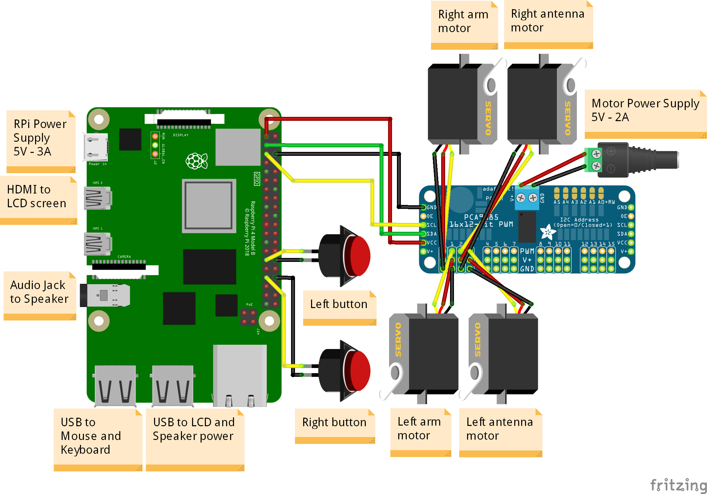

# Electronic

## Bill of materials

| Component       |    Quantity     |
| :-------------: | :-------------: |
| Raspberry Pi 4 (8GB)  |        1        |
| [Raspberry Pi power supply (5V - 3A)](https://www.amazon.fr/LEICKE-Alimentation-RPI4-CASE-RW-KSA-15E-051300HE-interrupteur/dp/B085HTV69S/ref=sr_1_10?keywords=raspberry+pi+4+power+supply&qid=1685008481&sprefix=raspberry+pi+4+powe%2Caps%2C75&sr=8-10)  |        1        |
| [SD card (32GB)](https://www.amazon.fr/SanDisk-M%C3%A9moire-microSDHC-Adaptateur-homologu%C3%A9e/dp/B08GY9NYRM/ref=sr_1_6?keywords=sd+card+32gb&qid=1675702913&sr=8-6)  |        1        |
| [Micro SD card adaptor](https://www.amazon.fr/Vanja-Adaptateur-Connecteur-Notebooks-Smartphones/dp/B00W02VHM6/ref=sr_1_5?__mk_fr_FR=%C3%85M%C3%85%C5%BD%C3%95%C3%91&crid=DXPTPPN8AI8&keywords=adaptateur+carte+micro+sd&qid=1685008098&sprefix=adaptateur+carte+micro+s%2Caps%2C79&sr=8-5)  |        1        |
| [Speaker](https://www.amazon.fr/gp/product/B07RFQKY4R/ref=ppx_yo_dt_b_asin_title_o02_s01?ie=UTF8&psc=1)  |        1        |
| [3.5mm Stereo audio cable - Male to Female](https://www.amazon.fr/gp/product/B01CNAUYBY/ref=ppx_yo_dt_b_asin_title_o06_s01?ie=UTF8&psc=1)  |        1        |
| [5" HDMI LCD display](https://www.amazon.fr/dp/B096ZSZFC8?psc=1&ref=ppx_yo2ov_dt_b_product_details) |        1        |
| [Motor power supply (5V - 2A)](https://www.amazon.fr/Alimentation-Zolt-Transformateur-Universel-Electronique/dp/B0B1M9SFHC/ref=sr_1_37?__mk_fr_FR=%C3%85M%C3%85%C5%BD%C3%95%C3%91&crid=5TPLDRYMSQ4Z&keywords=Adaptateur+Secteur+5V+2A+Chargeur+d%27alimentation&qid=1675177497&sprefix=adaptateur+secteur+5v+2a+chargeur+d%27alimentation%2Caps%2C70&sr=8-37) |        1        |
| [PCA9685](https://www.amazon.fr/gp/product/B07RG9ZTMD/ref=ppx_yo_dt_b_asin_title_o00_s02?ie=UTF8&psc=1)  |        1        |
| [SG90 servo motor](https://www.amazon.fr/gp/product/B07Q1GJJZS/ref=ppx_yo_dt_b_asin_title_o01_s00?ie=UTF8&psc=1)  |        4        |
| [Push pull button](https://www.amazon.fr/Larcele-Momentan%C3%A9-Bouton-Poussoir-Bricolage-Bouton-poussoir/dp/B06XCSB9N3/ref=sr_1_103?__mk_fr_FR=%C3%85M%C3%85%C5%BD%C3%95%C3%91&crid=3RSI6R6IKA8PC&keywords=push+pull+button&qid=1675177887&sprefix=push+pull+button%2Caps%2C83&sr=8-103)  |        2        |
| [Male to Male wire](https://www.amazon.fr/120pcs-femelle-Arduino-Raspberry-breadboard/dp/B01BKN8UX4/ref=sr_1_5?keywords=cable+arduino+femelle+femelle&qid=1685008355&sprefix=cable+arduino%2Caps%2C80&sr=8-5)  |        2        |
| [Female to Female wire](https://www.amazon.fr/120pcs-femelle-Arduino-Raspberry-breadboard/dp/B01BKN8UX4/ref=sr_1_5?keywords=cable+arduino+femelle+femelle&qid=1685008355&sprefix=cable+arduino%2Caps%2C80&sr=8-5)  |        4        |
| [Male to Female wire](https://www.amazon.fr/120pcs-femelle-Arduino-Raspberry-breadboard/dp/B01BKN8UX4/ref=sr_1_5?keywords=cable+arduino+femelle+femelle&qid=1685008355&sprefix=cable+arduino%2Caps%2C80&sr=8-5)  |        4        |

## Circuit schematic

